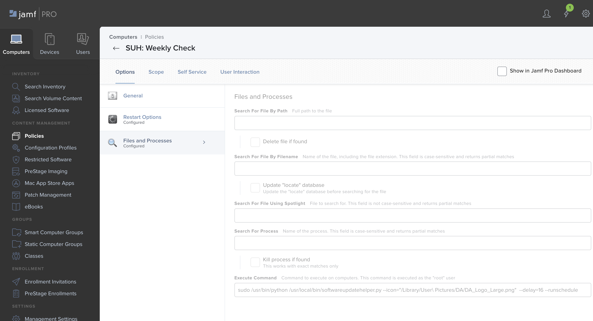
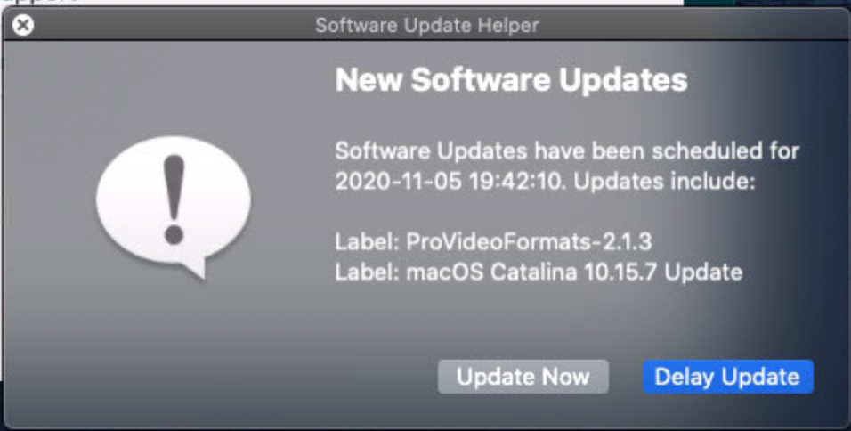
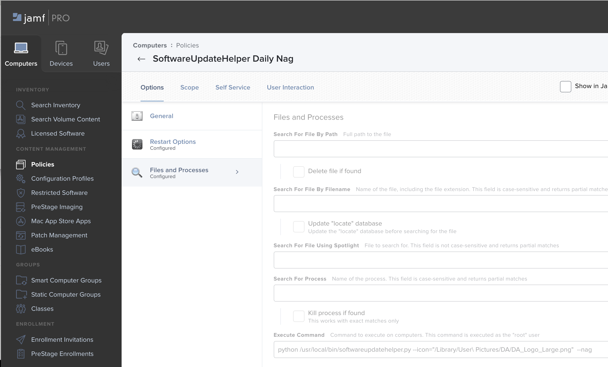
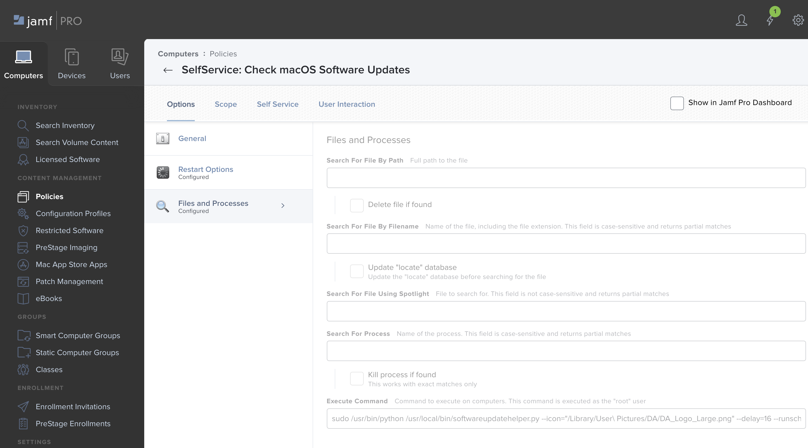

# Software Update Helper

The purpose of this project is to provide a wrapper 
around softwareupdate that gives admins more control 
over applying updates to Macs.  

Software Update Helper allows you to schedule regular updates 
and report back to a management system like JAMF Pro.

## Build Package
Using Luggage:
https://github.com/unixorn/luggage
```
make pkg
```

## Setup: JAMF Policies

### Scheduled Check
Create a policy that runs at a frequency you prefer (weekly?) for the machine to check-in with the Software Update Server
 and get updates.

If updates are available they will be scheduled to force install in --delay days in the future.  The forced install is 
triggered by the next time runschedule executes after the scheduled date.

```
sudo /usr/bin/python /usr/local/bin/softwareupdatehelper.py --icon="/Library/User\ Pictures/Fun/Medal.png"  --delay=16 --runschedule
```





### Daily Nag
Create a policy to nag the user at the frequency you prefer to prompt them to install the updates (daily?).  This gives the 
end-user a chance to delay the install at a convenient time before the forced scheduled install.

```
python /usr/local/bin/softwareupdatehelper.py --nag
```




### Self-Service Policy
Create a Self-Service Policy that allows users to install updates anytime.

```
python /usr/local/bin/softwareupdatehelper.py --runnow
```



### Reserves (Optional)
SoftwareUpdateHelper also can reserve some space on the disk that can be "saved" for the IT admin.  
This space can be freed up as needed by software updates.  One use for this is 
major OS upgrades.  Use SoftwareUpdateHelper to toggle the reserved space on/off as needed. This is done
by creating a disk image named SUH.dmg in /usr/local/share/SUH/.

Turn on
```
python /usr/local/bin/softwareupdatehelper.py --reserves=on
```

Turn off
```
python /usr/local/bin/softwareupdatehelper.py --reserves=off
```

## Help
```
sudo python ./softwareupdatehelper.py --help
Note the order when using switches
--help (-h) : This help.
--version (-v) : Print Version.
--lastrun (-l) : Print last time script was run.
--icon= (-i) : Full path to icon.png
--delay= (-d) : How long in days since last run to wait before checking again.
--runnow (-r) : Run software update now.
--runschedule (-s) : Run software update based on schedule.
--nag (-n) : Check to if updates are scheduled and prompt to install again.
--reserves= (-z) : Set to on to create reserves space and off to remove it.
```